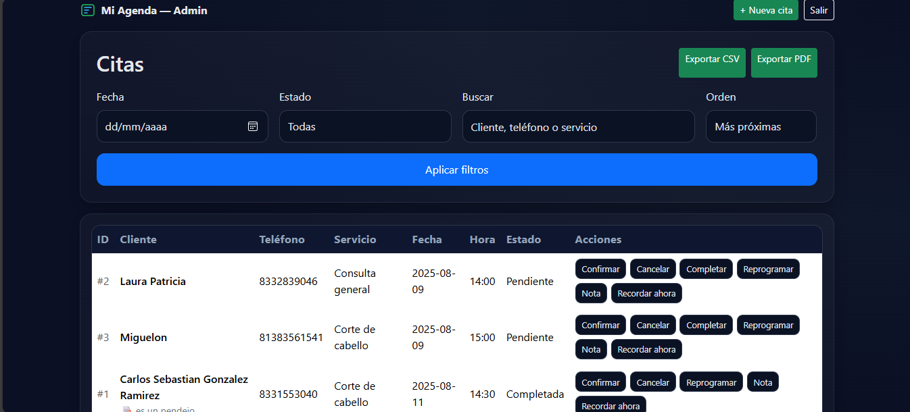
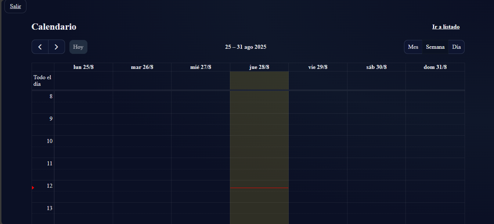
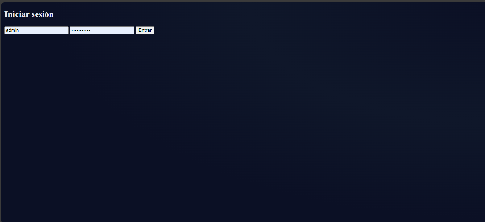

# 📅 Appointment Scheduler

A **PHP + MySQL** appointment booking system designed for clinics, beauty salons, workshops, and more.  
It allows clients to easily book appointments and admins to manage availability.

---

## 🚀 Features

- Client registration with contact details 📇  
- Appointment booking with availability validation 🗓️  
- Time slot selection with configurable intervals ⏰  
- WhatsApp reminders (simulated / in progress) 💬  
- Admin panel to manage clients and appointments 👨‍💻  

---

## 📸 System Screenshots

### 🏠 Admin Page


### 📋 Appointment Form


### 📅 Appointments Calendary


### Login

---

## ⚙️ Installation

1. Clone this repository:  
   ```bash
   git clone https://github.com/yourusername/appointment_scheduler.git

2. Import the database into MySQL:
    The script is located in db.sql

3. Configure your database connection in db.php
    ```bash
    $host = "localhost";
    $user = "root";
    $pass = "";
    $db   = "appointment_scheduler";

4. Start your local server with XAMPP (or similar) and open in your browser:
    ```bash
    http://localhost/appointment_scheduler/

---

##  📂 Project Structure
    appointment_scheduler/
    │── assets/              Images and styles
    │── db.php               Database connection
    │── index.php            Main page
    │── formulario.php       Appointment form
    │── panel.php            Admin panel
    │── recordar_ahora.php   Reminder script
    │── db.sql               Database script
    │── README.md

---

## Future Improvements
    Real WhatsApp reminders using WhatsApp API

    Login system with role separation (client / admin)

    Dashboard with statistics 📊

    Export appointments to CSV/Excel

--- 

## Author
Developed by Carlos Sebastián González Ramírez.
If you found this project useful, don’t forget to leave a ⭐ on the repo!
